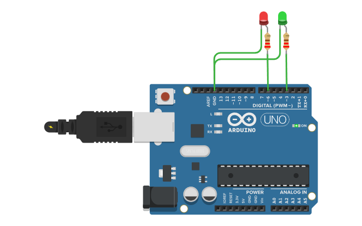
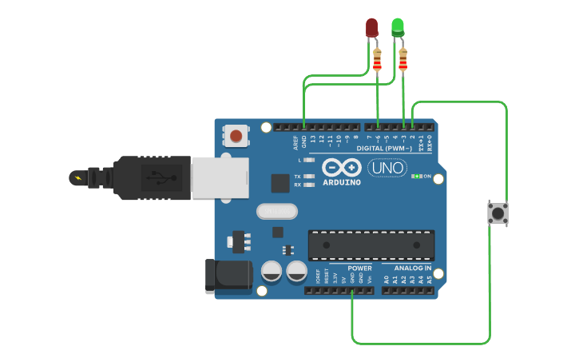
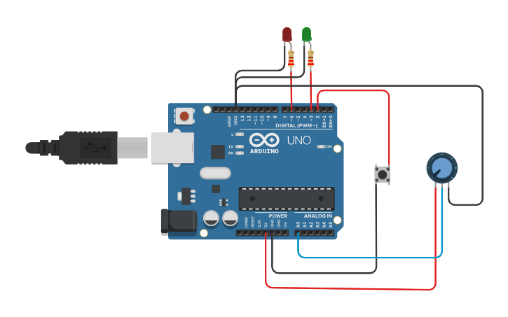

# Lab 01: Pins, Buttons & Potentiometers

Σε αυτό το εργαστήριο υλοποιούνται 3 βασικά κυκλώματα ελέγχου LED μέσω ψηφιακών και αναλογικών εισόδων.
Όλος ο κώδικας βρίσκεται στο αρχείο `lab01_pins_buttons_potentiometer.ino`. Μπορείτε να αλλάξετε τη μεταβλητή `#define EXERCISE` στην κορυφή του κώδικα για να εκτελέσετε την αντίστοιχη άσκηση.

---

### Άσκηση 1: Σταθερός Φωτισμός & PWM
Άναμμα ενός LED σταθερά (Digital Pin) και ενός δεύτερου LED στο 40% της φωτεινότητάς του μέσω Pulse Width Modulation (PWM).

---

### Άσκηση 2: Ψηφιακή Είσοδος (Push Button)
Προσθήκη ενός Push Button με χρήση της εσωτερικής αντίστασης του μικροελεγκτή (`INPUT_PULLUP`). Με το πάτημα του κουμπιού αλλάζει η κατάσταση των LED (το ένα ανάβει, το άλλο αυξάνει τη φωτεινότητά του στο 80%).

---

### Άσκηση 3: Αναλογική Είσοδος (Potentiometer)
Προσθήκη ποτενσιόμετρου για δυναμικό έλεγχο. Το PWM του δεύτερου LED ελέγχεται απευθείας από την αναλογική τιμή του ποτενσιόμετρου (αναγωγή 0-1023 σε 0-255).

