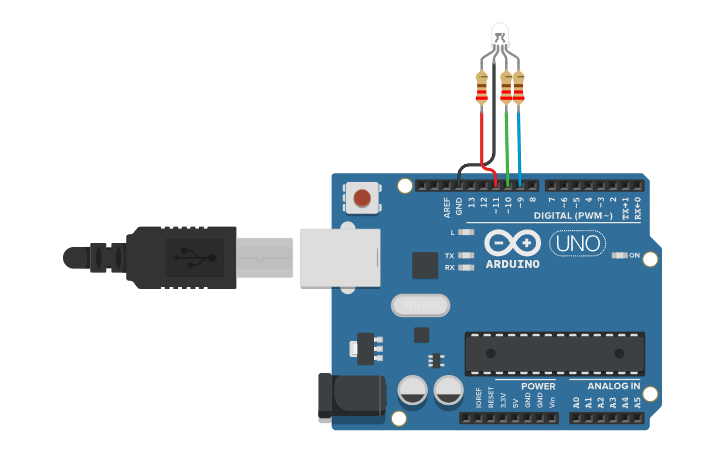
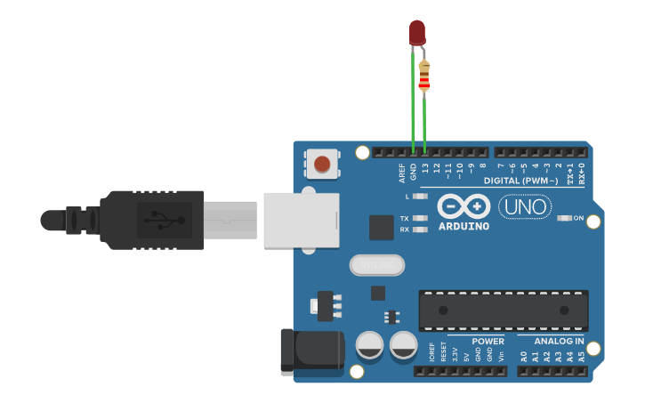
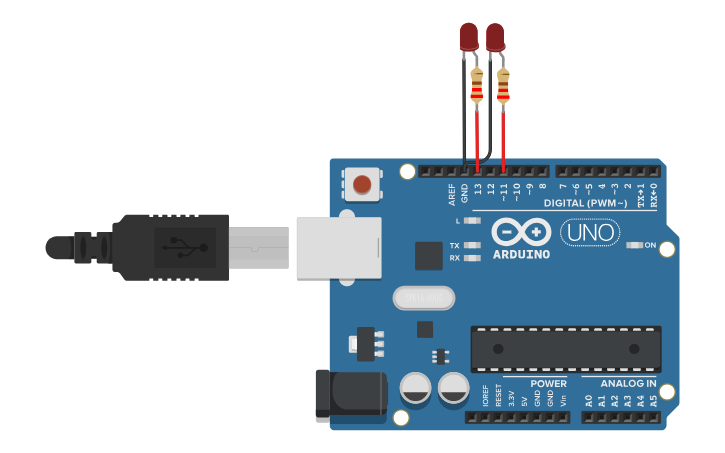

# Lab 02: Serial Communication & Timing

Σε αυτό το εργαστήριο εξετάζεται η διαχείριση ενός RGB LED μέσω εντολών από τη σειριακή θύρα (Serial Monitor), καθώς και η διαφορά μεταξύ των συναρτήσεων `delay()` και `millis()` για τον ταυτόχρονο χρονισμό πολλαπλών ενεργειών.

Όλος ο κώδικας βρίσκεται στο αρχείο `lab02_serial_timing_rgb.ino`. Αλλάξτε τη μεταβλητή `#define EXERCISE` στην κορυφή για να επιλέξετε την αντίστοιχη άσκηση.

---

### Άσκηση 1: Έλεγχος RGB LED μέσω Serial
Το Arduino διαβάζει συμβολοσειρές (Strings) από το Serial Monitor. Αν δοθεί η λέξη "kitrino" ή "mov", το RGB LED παίρνει το αντίστοιχο χρώμα μέσω PWM. Σε οποιαδήποτε άλλη είσοδο, επιστρέφει μήνυμα λάθους.

---

### Άσκηση 2: Απλό Blink με `delay()`
Αναβόσβημα ενός απλού LED κάθε 500ms με χρήση της (blocking) συνάρτησης `delay()`.

---

### Άσκηση 3: Ταυτόχρονο Blink 2 LED με `millis()`
Ανεξάρτητο αναβόσβημα δύο LED (το πρώτο κάθε 300ms, το δεύτερο κάθε 1sec). Η χρήση της συνάρτησης `millis()` επιτρέπει στο Arduino να μην "κολλάει", επιτυγχάνοντας multi-tasking.

