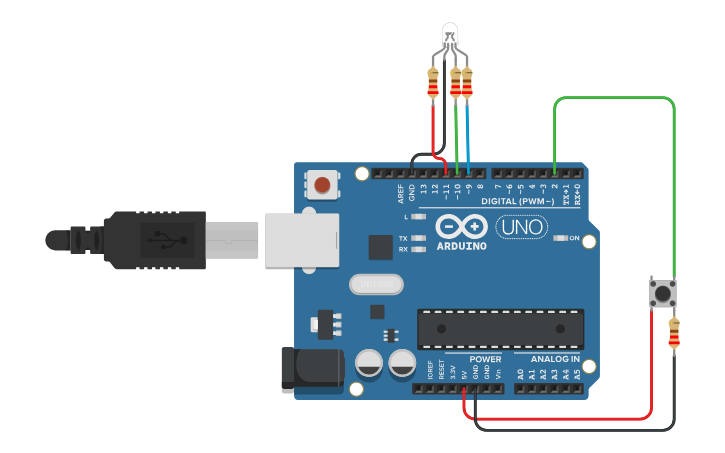
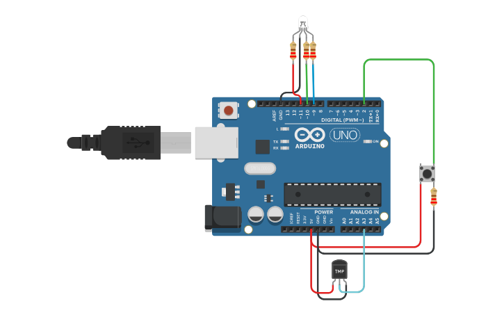
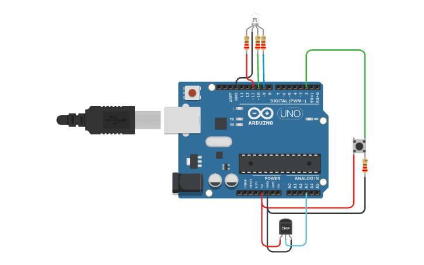

# Lab 03: Interrupts & Peripherals (TMP36)

[cite_start]Σε αυτό το εργαστήριο χρησιμοποιούμε **Hardware Interrupts** για ακαριαία απόκριση σε εξωτερικά ερεθίσματα (πατήματα κουμπιών), και διαβάζουμε αναλογικές τιμές από τον αισθητήρα θερμοκρασίας TMP36 [cite: 1049-1051].

Όλος ο κώδικας βρίσκεται στο αρχείο `lab03_interrupts_tmp36.ino`. Αλλάξτε τη μεταβλητή `#define EXERCISE` στην κορυφή για να επιλέξετε την αντίστοιχη άσκηση.

**Pro-Tip για τον κώδικα:** Στην Άσκηση 3, έχει χρησιμοποιηθεί `volatile` boolean flag μέσα στο ISR (Interrupt Service Routine). Η ανάγνωση της θερμοκρασίας (`analogRead`) και η εκτύπωση στο Serial Monitor γίνονται με ασφάλεια εντός της `loop()` για την αποφυγή buffer locking.

---

### Άσκηση 1: Εναλλαγή Χρωμάτων με Interrupt
Χρήση της `attachInterrupt()` στο Pin 2. Με κάθε πάτημα του κουμπιού αλλάζει ακαριαία το χρώμα του RGB LED (από κίτρινο σε μωβ). [cite_start]Οι μεταβλητές των χρωμάτων δηλώθηκαν ως `volatile` [cite: 1044-1046].

---

### Άσκηση 2: Αισθητήρας Θερμοκρασίας (TMP36)
Ανάγνωση θερμοκρασίας κάθε 2.5 δευτερόλεπτα με χρήση της `millis()` (non-blocking). [cite_start]Το RGB LED δείχνει Κόκκινο για > 25°C, Μπλε για < 5°C, και Κίτρινο για ενδιάμεσες θερμοκρασίες [cite: 1052-1056].

---

### Άσκηση 3: Hardware Override (Interrupt & Sensor)
Συνδυασμός των δύο προηγούμενων. Το Arduino διαβάζει τη θερμοκρασία κάθε 2.5s. [cite_start]Αν όμως ο χρήστης πατήσει το κουμπί (Interrupt), το σύστημα κάνει ακαριαία νέα μέτρηση, ανανεώνει το LED και μηδενίζει το χρονόμετρο της `millis()`.

