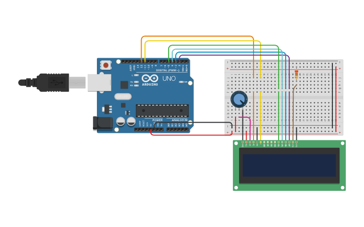

# Lab 04: Peripherals (LCD & Ultrasonic)

Σε αυτό το εργαστήριο χρησιμοποιούμε εξωτερικές περιφερειακές συσκευές, κάνοντας χρήση εξειδικευμένων βιβλιοθηκών, όπως η `<LiquidCrystal.h>`. 

Όλος ο κώδικας βρίσκεται στο αρχείο `lab04_peripherals_lcd_ultrasonic.ino`. Αλλάξτε τη μεταβλητή `#define EXERCISE` στην κορυφή για να επιλέξετε την αντίστοιχη άσκηση.

---

### Άσκηση 1: HD44780 LCD - Κυλιόμενο Κείμενο (Scrolling Text)
Οδήγηση μιας οθόνης χαρακτήρων LCD (HD44780). Η διασύνδεση απαιτεί 6 data pins. Στον κώδικα υλοποιήθηκε ένας έξυπνος αλγόριθμος χρησιμοποιώντας τον τελεστή modulo (`%`) για τη δημιουργία ενός ατέρμονου κυλιόμενου κειμένου (scrolling text) 16 χαρακτήρων.

